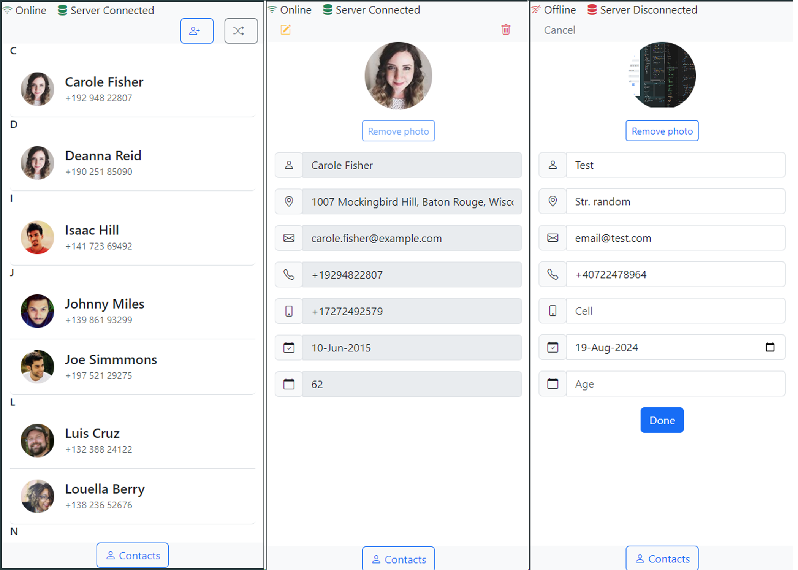

# Angular Contact Manager - Offline SPA

## Overview

This project is a Single Page Application (SPA) built using Angular, designed to manage contacts through mobile devices. It supports offline functionality, allowing users to create, edit, and delete contacts even when there is no network connectivity. Once the application regains connectivity, all changes are synchronized with the backend.

## Features

- **Contact List Page:**
  - Displays a list of contacts with key fields and an image.
  - Provides options to create a new contact or add random contacts using the [Random User API](https://randomuser.me/).
  - Clicking on a contact redirects to the detail page.

- **Contact Detail Page:**
  - Allows viewing, editing, and deleting of contact details.
  - Supports field validation (email, phone, etc).

- **Offline Mode:**
  - Full CRUD operations are supported offline.
  - Changes made offline sync with the backend once the connection is restored.

- **Mobile-First UI:**
  - The application is optimized for mobile devices.

## Technologies Used

- Angular, PWA, Dexie.js (IndexedDB)
- NodeJs, Express.js, SQLite


## Prerequisites

Before you begin, ensure you have the following installed:

- **Node.js** (v15.x or higher)
- **npm** (v10.x or higher)
- **Angular CLI** (v18.x or higher)


## Installation

This repository contains two main components:

- **contacts-server**: The backend of the application, built using Node.js and Express.
- **contacts-ui**: The frontend of the application, built using Angular.


1. **Clone the Repository:**
```bash
git clone https://github.com/iulian-coder/contact-manager-angular-offline
```

2. **Install Backend Dependencies (contacts-server)**
```bash
cd contacts-server
npm install
```
3. **Install Frontend Dependencies (contacts-ui)**
```bash
cd contacts-ui
npm install
```

## Run the Application

### 1. Start the Backend Server

Navigate to the contacts-server directory and start the Node.js server:

```bash
cd contacts-server
npm start
```
The backend server will start on http://localhost:3000


### 2. Start the Frontend Server
Navigate to the contacts-ui directory and start the Angular server:
```bash
cd contacts-ui
ng serve
```
The frontend server will start on http://localhost:4200

### 3. Access the Application
Open your browser and go to http://localhost:4200


## Screenshot


## License
This project is for educational purposes and is not intended for production use.